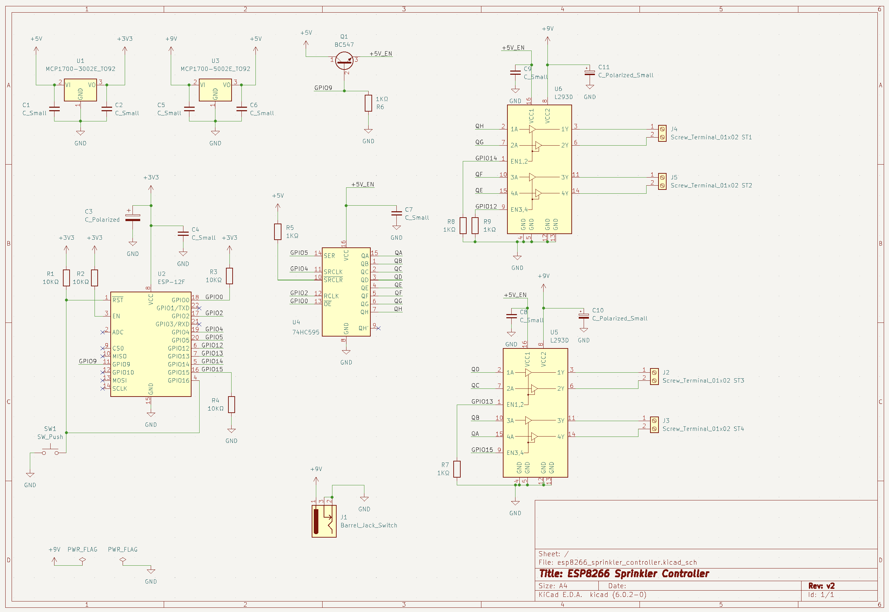

# ESP8266 sprinkler controller
 
A WiFi lawn irrigation controller using an [ESP-12F WiFi module](https://docs.ai-thinker.com/_media/esp8266/docs/esp-12f_product_specification_en.pdf) to drive up to 4 sprinkler stations.
 
The sprinkler stations can be controlled and programmed remotely using [Home Assistant](https://www.home-assistant.io/).
 
The ESP8266 board communicates with Home Assistant using an [MQTT](https://mqtt.org/) broker on the local WiFi network. The ESP8266 listens to events in order to turn on/off and to program the schedule for each sprinkler station.
 
The controller is powered by a 9V battery as this is also the voltage required to activate the solenoids for each sprinkler. Being a battery powered device, the efficiency of the circuit is very important. The ESP8266 needs to be in deep sleep as much as possible and only wake up for activating/deactivating sprinkler stations.
 
There is also an interface mode that can be activated explicitly using Home Assistant. In interface mode, the ESP8266 will not go into deep sleep and is always ready to receive commands to activate/deactivate stations and configure the system. This mode is useful if we need to test a specific sprinkler station or if we need to trigger the stations manually.
 
The controller is also equipped with a reset button which will force the system to wake up from deep sleep, and go into interface mode (if enabled).
 

 

 
## MQTT Topics
 
### Subscribe
 
| Topic                                | Payload format                                      | Payload example            | Retained |
| ------------------------------------ | --------------------------------------------------- | -------------------------- | -------- |
| `lawn-irrigation/station{x}/set`     | `{"on","off"}\|{"duration in milliseconds"}`        | `"on\|18000" ; "off"`      | false    |
| `lawn-irrigation/station{x}/config`  | `{"cron expression"}\|{"duration in milliseconds"}` | `"0 30 6 1-31/2 * *\|900"` | true     |
| `lawn-irrigation/interface-mode/set` | `{"on","off"}`                                      | `"on" ; "off"`             | true     |
| `lawn-irrigation/enabled/set`        | `{"on","off"}`                                      | `"on" ; "off"`             | true     |
 
 
### Publish
 
| Topic                                   | Payload format | Payload example | Retained |
| --------------------------------------- | -------------- | --------------- | -------- |
| `lawn-irrigation/station{x}/state`      | `{"on","off"}` | `"on" ; "off"`  | false    |
| `lawn-irrigation/interface-mode/state`  | `{"on","off"}` | `"on" ; "off"`  | false    |
| `lawn-irrigation/log`                   |  `<string>`    | `"log string"`  | true     |
 
## How to configure Home Assistant
 
The esp8266 sprinkler controller is configured from [Home Assistant](https://www.home-assistant.io/) using [MQTT switches](https://www.home-assistant.io/integrations/switch.mqtt/) and input fields.
 
As an example, here is my lawn irrigation card within the Home Assistant dashboard. I have three sprinkler stations configured:
 

 

 
Each station is controlled by a different MQTT switch. The switches automatically display the station state and are also used to trigger the stations manually (provided that the controller is in **interface mode**).
 
Besides the station controller switches and CRON inputs, there are two additional switches to toggle:
- the interface mode
- the irrigation itself.
 When the irrigation controller is in **interface mode**, the ESP8266 will not go into deep sleep and the user can toggle the stations directly.
 
The irrigation toggle switch can be used to skip the programmed schedule. As an example, it is possible to disable the irrigation if rain is forecast for the next 12 hours or is has rained in the last 12h.
 
Apart from the switches, [Input Text Fields](https://www.home-assistant.io/integrations/input_text/) are used to configure the CRON expression and duration for each station. An automation is also required so that an MQTT event is published whenever the text field changes.
 
If a station is activated due to the configured cron expression schedule, the respective switch will be updated automatically with the current status as an MQTT event is sent from the controller whenever there is a station event.
 
You can find an example on how to configure these MQTT switches and text fields on the HA examples included in this repository:
- [configuration.yaml](/ha/configuration.yaml)
- [automations.yaml](/ha/automations.yaml)
 
 
## Circuit
 
### Power
 
Because the solenoids that activate the sprinklers require 9V to activate, this circuit is powered by a 9V battery (two 9V batteries in parallel to be precise). A voltage regulator is used to step down from 9v to 5v so that we can power some 5v ICs in the circuit. The ESP-12F requires 3.3V. Therefore, another voltage regulator was added to step down from 5v to 3.3v. This is not ideal, as there are two voltage regulators but in this case we require 3 different voltages and it would not be practical to have multiple batteries for the same circuit.
 
### Latching solenoids and the L293D ICs
 
There are two L293D ICs in this circuit. These are Quadruple Half-H Drivers that are designed to provide bidirectional drive currents. The L293D is also designed to drive inductive loads such as solenoids and motors. These ICs allow us to drive the 9v power lines to the solenoid with a 3.3v logic signal provided by the ESP8266.
 
A latching solenoid uses an electrical current pulse or internal permanent magnet material to maintain a set position without the constant application of power. Latching solenoids (also known as bistable solenoids) have two standard positions; de-energized with the plunger fully extended and de-energized with the plunger held in position by permanent magnets.
 
Electrical polarity is vital to proper latching a solenoid. As current flows in one direction, adds to the pull of the permanent magnet. Sending a current through the coil field in the opposite direction cancels the magnet’s attraction and releases the plunger from the latched position.
 
These L293D ICs are required in order to control our latching solenoids because we need to provide opposite polarities depending on if we are activating or deactivating the solenoid.
 
Each L293D can control two solenoids. Hence two L293D ICs were used to drive a total of 4 solenoids/sprinkler stations.
 
### The lack of pins and the 8-bit shift register
 
Because the ESP12-F only provides 11 GPIO digital pins, an 8-bit shift register was included so we can have more digital lines to drive the four possible solenoids/stations.
 
### Power Efficiency
 
This is a very important topic as this circuit is powered with standard 9v batteries. Depending on the battery type, usually a 9v battery has a capacity of around 300 mAh.
We must guarantee that our circuit is as efficient as possible. Ideally, the standby current of the circuit should not exceed 50uA. In these conditions, I estimate around 300 to 400 days on double 9v batteries.
 
Operating normally, without any changes to improve the efficiency of the circuit, the average current is about 90mA to 130mA. This includes the ESP8266 making WiFi requests, the two L293D ICs, the 8-bit shift register, and added the voltage regulators.
 
If we put the ESP8266 in deep sleep mode, the current drops to about 50mA to 60mA. This is still too high. The culprits are the two L293D ICs which have a very high quiescent current of about 30mA each.
 
Hence, to reduce the quiescent current of the L293D ICs, the power is supplied to these ICs only when stations need to be activated/deactivated. To achieve this, a simple NPN transistor is used to turn off the shift register and both L293D ICs. This transistor is driven by the ESP8266.
 
Even though the L293D ICs are not connected to power in standby mode, some pins can have enough voltage to pull the ESP-12F GPIO15 line HIGH thus preventing the ESP-12F from booting. The solution was to add a diode between the GPIO15 enable line and the L293D chip.
 
After these improvements, I measured the standby current of the circuit to around **20uA**.
 
### Schematic
 

 

 
### BOM
 
 
| Part                                 | Qty |
| ------------------------------------ | --- |
| ESP-12F (ESP8266)                    | x1  |
| L293D (Quadruple Half-H Drivers)     | x2  |
| 74HC595 (8-bit shift register)       | x1  |
| MCP1702-5002E/TO (voltage regulator) | x1  |
| MCP1702-3302E/TO (voltage regulator) | x1  |
| BC547 (NPN transistor)               | x1  |
| 1k resistor                          | x4  |
| 10k resistor                         | x5  |
| 100 uF electrolytic capacitor         | x2  |
| 10 uF electrolytic capacitor          | x1  |
| 1 uF ceramic capacitor (104)         | x8  |
| SD101A (Schottky Diode)              | x1  |
| Switch (reset)                       | x1  |
| Barrel Jack Switch                   | x1  |
| Screw terminal                       | x4  |
| 9v battery                           | x2  |
| Rainbird solenoids                   | x3  |
 
 

